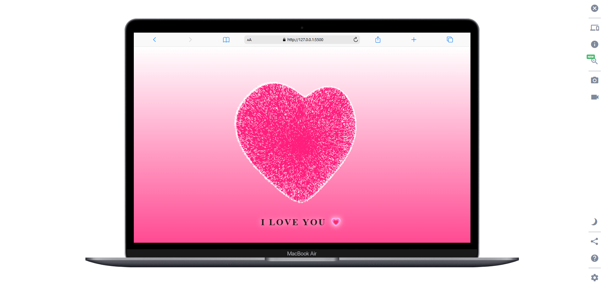

# 💖 Women’s Day Surprise Website 🚀  
*A 3D Love Experience for Her*  

 <!-- Add a GIF/video preview here -->

**Live Demo:** [https://happy-womens-dayy.netlify.app/](https://happy-womens-dayy.netlify.app/) <!-- Add your hosted link here -->  

## 🌟 Story Behind the Code  
I built this interactive website to surprise my girlfriend on **Women’s Day**! It features a hidden 3D rotating heart, custom cursor animations, and a heartfelt message. When she clicks "OPEN", the love page reveals a **360° interactive heart** with "I LOVE YOU" text. Perfect for coders who want to romance their partners uniquely!  

---

## 🛠️ Features  
- **3D Rotating Heart**: Draggable & interactive using Three.js.  
- **Custom Cursor Animation**: Smooth "clicklove.js" effect.  
- **Responsive Design**: Works on mobile & desktop.  
- **Hidden Surprise Page**: Click "OPEN" to reveal the love message.  
- **SEO-Friendly**: Built for virality (Instagram-ready!).  

---

## 🚀 Tech Stack  
- **Frontend**: HTML5, CSS3, JavaScript  
- **3D Animation**: Three.js  
- **Cursor Effects**: Custom JavaScript (clicklove.js)  
- **Hosting**: GitHub Pages / Netlify / Vercel  

---

## ⚡ Quick Start  
1. **Clone the repo**:  
   ```bash  
   git clone https://github.com/Aoudumber-Bade/Womens-day-surprise.git 

## 🌈 Customize for Your Partner  
1. **Replace text** in `index.html` (line 42) with your message.  
2. **Tweak heart colors** in `styles.css` (search for `--heart-color` variable).  
3. **Add your own photos/videos** to the `assets/` folder.  

## 🤝 Contributing  
Feel free to fork and customize!  
- Add more animations (e.g., floating particles).  
- Implement a love letter slider.  
- Add music on button click.  
- **Tag me on Insta** if you create a version – I’ll feature it!  

## 💌 Acknowledgments  
- Inspired by my amazing girlfriend ❤️  
- Three.js community for 3D magic.  
- You – for spreading love through code!  

## 📄 License  
MIT License – *Code with love, share with the world!*  